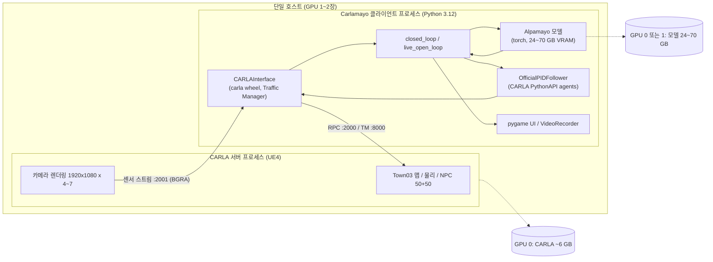
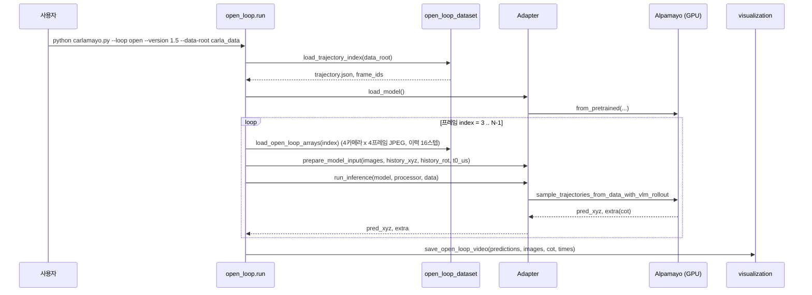
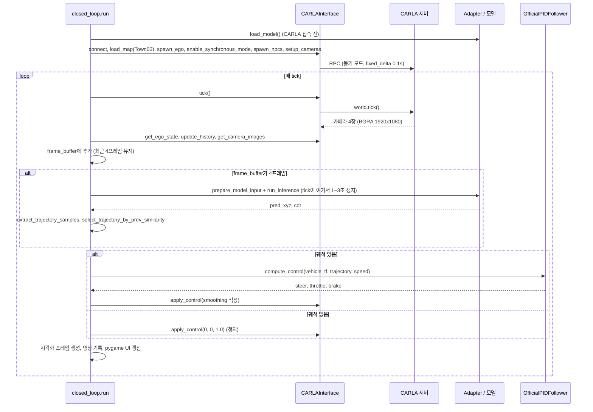
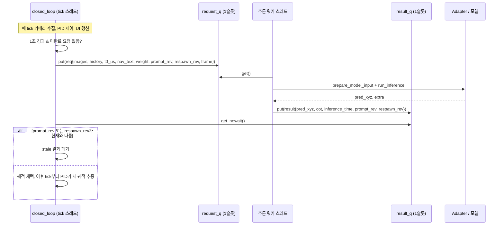
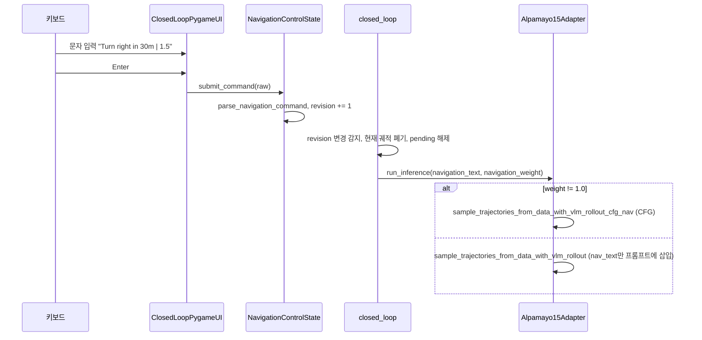
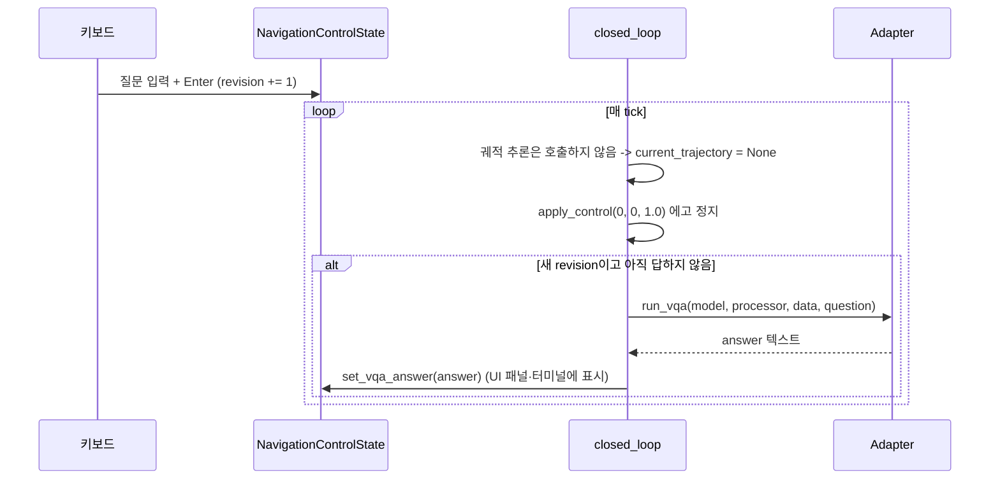

# Carlamayo 현재 구조 분석 (단일 호스트 기준)

기준 소스: 업스트림 `aveeslab/Carlamayo` 커밋 `e6372ea`
(Support Alpamayo 1 / 1.5 / 2 via --version and add a unified live-open-loop launcher).

이 문서는 분리(CARLA 인스턴스 / Alpamayo 인스턴스) 작업의 근거 자료로, **지금 코드가 어떤
프로세스·모듈·데이터 흐름으로 동작하는지**를 정리한다. 분리 후 구조는
[distributed-architecture.md](distributed-architecture.md)에서 다룬다.

---

## 1. 시스템 개요

Carlamayo는 NVIDIA Alpamayo(비전-언어-행동 주행 모델)를 CARLA 시뮬레이터에 연결하는
연구용 통합 코드다. 한 호스트에서 다음 두 프로세스가 동작한다.

| 프로세스 | 무엇을 하는가 | 주요 자원 |
|---|---|---|
| **CARLA 서버** (`CarlaUE4.sh -RenderOffScreen`) | Unreal Engine 4 기반 시뮬레이터. 맵, NPC, 물리, 카메라 렌더링 | GPU 약 6 GB VRAM, CPU 다수 코어, 포트 2000(RPC)·2001(센서 스트림)·8000(Traffic Manager) |
| **Carlamayo 클라이언트** (`python carlamayo.py ...`) | CARLA에 접속해 차량·센서를 만들고, Alpamayo 모델을 같은 프로세스에 로드해 추론하고, PID로 차량을 제어 | GPU 24 GB(1.5/R1) 또는 70 GB(2) VRAM, Python 3.12 |

즉 **시뮬레이션 제어와 모델 추론이 한 Python 프로세스 안에 함께 있다.** 이것이 분리 대상이다.

### 1.1 구성요소 한눈에 보기

| 구성요소 | 파일 | 역할 |
|---|---|---|
| 런처 | `carlamayo.py` | `--version {1,1.5,2}`와 `--loop {open,closed,live-open}`를 받아 어댑터와 루프를 고름 |
| 버전 어댑터 | `module/adapters/{alpamayo_r1,alpamayo_1_5,alpamayo_2}.py`, `base.py` | 모델 로드, 입력 변환, 궤적 추론, VQA, CoT 추출을 버전별로 감싼 공통 인터페이스 |
| 카메라 리그 | `module/adapters/_rigs.py` | 4카메라(1/1.5) 또는 7카메라(2) 배치와 FOV |
| CARLA 인터페이스 | `module/carla_interface.py` | 접속, 맵 로드, 동기 모드, 에고/NPC 스폰, 카메라·충돌 센서, 이력 버퍼, 제어 적용 |
| 루프 | `module/loops/{open_loop,closed_loop,live_open_loop}.py`, `_common.py` | 세 가지 실행 모드의 메인 루프 |
| PID 추종기 | `module/pid_controller.py` | 예측 궤적을 조향/가속/제동으로 변환 (CARLA 공식 `VehiclePIDController` 사용) |
| 프롬프트 상태 | `module/navigation_control.py` | navigation 텍스트·CFG 가중치·VQA 질문·일시정지 상태 |
| pygame UI | `module/pygame_ui.py` | 카메라 화면 + 텍스트 입력 패널 |
| 시각화/영상 | `module/visualization.py` | 궤적 오버레이, mp4 기록, ffmpeg 변환 |
| 충돌 후 리스폰 | `module/respawn_control.py` | 충돌 감지 후 쿨다운을 두고 에고를 재배치 |
| OOM-free 로딩 | `module/oom_offload.py` | 1.5 전용 CPU↔GPU 레이어 스트리밍 |
| 데이터 수집 | `data_collect.py`, `module/data_collection.py` | 7카메라 + LiDAR + 궤적을 `carla_data/`에 기록 |
| 오프라인 데이터셋 | `module/open_loop_dataset.py` | `carla_data/`를 모델 입력으로 읽음 |
| 설정 | `module/config.py` | 해상도, 프레임 수, 맵, NPC 수, PID 게인 등 |

---

## 2. 배포 다이어그램 (현재: 한 호스트)

**GPU 공유 문제.** CARLA 서버와 모델이 같은 GPU에 있으면 VRAM이 부족해지기 쉽다.
업스트림은 이를 `--quantization`(4-bit), `--oom-free`(1.5 전용 레이어 스트리밍),
`-graphicsadapter=1`(CARLA를 두 번째 GPU로) 세 가지로 우회한다. `module/oom_offload.py`는
CARLA가 스폰을 끝낸 뒤 **남은 VRAM을 측정해서** 모델 레이어 배치를 정하는데, 이는 두
프로세스가 한 GPU를 공유한다는 전제 위에 설계된 코드다.

---

## 3. 모듈 의존 다이어그램

색 구분: 파란색은 `carla` 패키지를 import하는 모듈, 주황색은 `torch`를 import하는 모듈,
회색은 둘 다 없는 순수 Python/numpy 모듈이다. 분리 시 파란색은 CARLA 인스턴스, 주황색은
Alpamayo 인스턴스로 가야 하며, **두 색이 함께 들어 있는 루프 모듈이 분리의 대상**이다.

```mermaid
flowchart TB
    classDef carla fill:#cfe3ff,stroke:#1f5fbf,color:#000
    classDef torch fill:#ffe0c2,stroke:#c25e00,color:#000
    classDef both fill:#e8d5ff,stroke:#6a2fbf,color:#000
    classDef pure fill:#eeeeee,stroke:#666,color:#000

    L["carlamayo.py"]:::pure
    ADP["module/adapters/__init__.py<br/>get_adapter()"]:::pure
    BASE["adapters/base.py<br/>AlpamayoAdapter"]:::pure
    RIG["adapters/_rigs.py"]:::pure
    A15["adapters/alpamayo_1_5.py"]:::torch
    A2["adapters/alpamayo_2.py"]:::torch
    AR1["adapters/alpamayo_r1.py"]:::torch
    OOM["module/oom_offload.py"]:::torch
    INF["module/inference.py<br/>(torch import는 변환용)"]:::torch
    VIS["module/visualization.py<br/>(torch는 isinstance 검사)"]:::torch
    CLOSED["loops/closed_loop.py"]:::both
    LIVE["loops/live_open_loop.py"]:::both
    OPEN["loops/open_loop.py"]:::torch
    CIF["module/carla_interface.py"]:::carla
    PIDM["module/pid_controller.py"]:::carla
    DC["data_collect.py"]:::carla
    NAV["module/navigation_control.py"]:::pure
    UI["module/pygame_ui.py"]:::pure
    RESP["module/respawn_control.py"]:::pure
    DS["module/open_loop_dataset.py"]:::pure
    CFG["module/config.py"]:::pure

    L --> ADP --> BASE
    ADP --> A15 & A2 & AR1
    A15 & A2 & AR1 --> RIG
    A15 --> OOM
    L --> CLOSED & LIVE & OPEN
    CLOSED --> CIF & PIDM & INF & VIS & NAV & UI & RESP & CFG
    LIVE --> CIF & INF & VIS & CFG
    OPEN --> INF & DS & VIS & CFG
    DC --> RIG
    CIF --> CFG
    PIDM --> CFG
```

세 가지 관찰:

1. **어댑터 인터페이스(`AlpamayoAdapter`)가 이미 경계 역할을 한다.** 루프는 모델을 직접 만지지
   않고 `adapter.prepare_model_input()`과 `adapter.run_inference()`만 호출한다. 분리 시 이
   인터페이스를 그대로 구현하는 원격 어댑터를 끼우면 루프 코드 변경이 최소화된다.
2. **`torch`가 새는 지점이 다섯 곳 있다.** 모델과 무관한데 `import torch`를 하는 모듈이다.
   CARLA 인스턴스에 torch를 설치하지 않으려면 이 지점을 지워야 한다.

   | 파일 | 줄 | 실제 용도 |
   |---|---|---|
   | `module/inference.py` | 9 | `pred_xyz.detach().cpu().numpy()`와 `torch.backends.cuda.preferred_linalg_library` |
   | `module/visualization.py` | 10, 58 | `isinstance(pred_xyz, torch.Tensor)` 검사 하나 |
   | `module/loops/closed_loop.py` | 18, 128, 174 | `torch.cuda.memory_allocated()` 출력 |
   | `module/loops/live_open_loop.py` | 20, 80 | 같음 |
   | `module/loops/open_loop.py` | 16, 89, 110 | `torch.cuda.manual_seed_all(42)`, VRAM 출력 |

3. **PID 추종기는 CARLA 설치 트리에 의존한다.** `module/pid_controller.py:15-43`은
   `<CARLA_ROOT>/PythonAPI/carla/agents/navigation/controller.py`의 `VehiclePIDController`를
   import한다. 이 코드는 `carla.Transform`, `world`, 차량 객체가 필요하므로 CARLA 인스턴스에
   남아야 한다.

---

## 4. 실행 모드별 시퀀스

### 4.1 open-loop (`--loop open`): 오프라인 재생, CARLA 불필요

- 입력은 `data_collect.py`가 기록한 `carla_data/`(7카메라 JPEG + `trajectory.json`)이며, 어댑터의
  카메라 순서대로 4개 또는 7개 폴더를 골라 읽는다(`open_loop.py:50-51`, `open_loop_dataset.py:70-91`).
- 매 프레임 `torch.cuda.manual_seed_all(42)`로 시드를 고정한다(`open_loop.py:89`). 같은 GPU에서
  같은 데이터를 돌리면 재현 가능하다.

### 4.2 closed-loop 동기 모드 (`--loop closed`)

동기 모드에서는 **추론이 끝날 때까지 `world.tick()`이 호출되지 않으므로 시뮬레이터 세계가
멈춰 기다린다.** 결과의 결정성은 좋지만 실시간성은 없다.

### 4.3 closed-loop 비동기 모드 (`--loop closed --async`)

- 큐는 양쪽 다 크기 1이며 새 요청이 오면 이전 요청을 버린다(`closed_loop.py:274-275, 476-481`).
- 프롬프트 변경(`prompt_revision`)이나 충돌 리스폰(`respawn_revision`) 이후 도착한 옛 결과는
  버린다(`closed_loop.py:495-507`).
- 추론 실패 시 오류만 출력하고 **마지막 궤적을 계속 사용한다**(`closed_loop.py:545-548`).
  "Trajectory age"를 출력하지만(`654-655`) 오래된 궤적을 버리는 로직은 없다.

### 4.4 live-open-loop (`--loop live-open`)

closed-loop와 같은 카메라·추론 경로를 쓰되, 제어는 CARLA Traffic Manager 오토파일럿이 한다
(`live_open_loop.py:152 set_ego_autopilot(True)`). 모델 예측은 영상에 오버레이만 된다.
pygame UI는 없고, 충돌 시 리스폰 대신 로그만 남긴다.

### 4.5 navigation(CFG) 프롬프트 갱신 흐름 (`--mode navigation --pygame-ui`)

- 입력 형식은 `텍스트 | 가중치`이며 가중치 0은 지시 무시, 1은 일반 조건부, 1보다 크면 지시를
  증폭한다(`navigation_control.py:21-49`).
- CFG 샘플러는 1.5만 지원한다. 2는 가중치를 무시하고 일반 조건부로 대체한다(`alpamayo_2.py:151-155`).

### 4.6 VQA 흐름 (`--mode vqa --pygame-ui`)

VQA 모드는 궤적을 만들지 않으므로 **에고 차량은 계속 정지**한다(`closed_loop.py:557-574`,
`656-657`). 세계(NPC, 보행자)는 tick마다 움직인다. 모델의 텍스트 생성 API(`generate_text`)가
궤적을 반환하지 않기 때문이며, 공식 노트북도 같은 구조다(
[alpamayo15-notebooks-guide.md](alpamayo15-notebooks-guide.md) 참조).

---

## 5. 데이터 흐름과 크기

### 5.1 CARLA 서버 → 클라이언트 (매 tick, 10 Hz)

| 항목 | 값 | 근거 |
|---|---|---|
| 카메라 1장 | 1920×1080×4 B(BGRA) = 8,294,400 B ≈ **8.3 MB** | `carla_interface.py:294-295` |
| 4카메라(1/1.5) | 33 MB/tick → 332 MB/s @10 Hz | `_rigs.py FOUR_CAMERA_RIG` |
| 7카메라(2) | 58 MB/tick → 580 MB/s @10 Hz | `_rigs.py SEVEN_CAMERA_RIG` |
| 에고 상태 | 위치·회전·속도 7개 float | `get_ego_state` |
| 충돌 이벤트 | 수십 B, 발생 시만 | `_collision_callback` |

이 트래픽은 CARLA의 센서 스트림 포트(2001)로 흐르며, 현재는 loopback이라 비용이 거의 없다.
**분리 시 이 경로를 네트워크에 태우면 안 된다**는 것이 토폴로지 결정의 핵심 근거다
([ADR 0001](adr/0001-topology-client-on-sim-host.md)).

### 5.2 클라이언트 → 모델 (추론 요청, 약 1초에 1회)

| 텐서 | shape | dtype | 크기 |
|---|---|---|---|
| `images_array` (4캠) | (4, 4, 1080, 1920, 3) | uint8 | 99.5 MB |
| `images_array` (7캠) | (7, 4, 1080, 1920, 3) | uint8 | 174 MB |
| `history_xyz` | (16, 3) | float32 | 192 B |
| `history_rot` | (16, 3, 3) | float32 | 576 B |
| `t0_us` | 스칼라 | int | 8 B |
| `navigation_text`, `navigation_weight`, `vqa_question` | 문자열/float | | < 1 KB |

같은 이미지를 JPEG(품질 95)로 압축하면 장당 약 300~500 KB, 요청당 **5~8 MB**(4캠) 수준이다.
모델(1.5)은 입력 이미지를 196,608픽셀(약 512×384)로 다시 줄이므로(`alpamayo_1_5.py:123-124`)
1080p 원본의 정보 대부분은 어차피 버려진다.

### 5.3 모델 → 클라이언트 (추론 응답)

| 항목 | shape / 크기 |
|---|---|
| `pred_xyz` | (1, 1, S, 64, 3) float32, S=`NUM_TRAJ_SAMPLES`=1 → 768 B |
| CoT 텍스트 | 수백 B (최대 256토큰) |
| VQA 답변 | 수백 B |
| 추론 시간 등 메타 | 수십 B |

응답은 항상 **10 KB 미만**이다. 요청과 응답이 극단적으로 비대칭이며 요청의 99%가 이미지다.

### 5.4 데이터 수집 (`data_collect.py`)

`Town02`에서 오토파일럿으로 주행하며 매 tick 7카메라 JPEG(`cv2.imwrite`) + LiDAR PLY +
에고 포즈를 `carla_data/`에 쓴다. 완전한 프레임만 기록하고 마지막에 `trajectory.json`을
저장한다. 이 데이터가 open-loop의 입력이다. 여기서 **이미 JPEG로 저장**되므로 open-loop는
지금도 JPEG 재인코딩된 이미지를 모델에 넣고 있다.

---

## 6. 실행 환경

| 환경 | Python | 주요 패키지 | 용도 | 정의 파일 |
|---|---|---|---|---|
| `venv-carla` | 3.10 | carla 0.9.16, numpy, opencv, pygame | 데이터 수집 | `requirements-carla.txt` |
| `a_venv` | 3.12 | torch 2.8, transformers 4.57.1, flash-attn, alpamayo1_5 등 | open-loop | `pyproject.toml`, `requirements-alpamayo.txt` |
| `a_carla_venv` | 3.12 | 위 둘의 합집합 | closed-loop, live-open | 위 셋 전부 |

| 모델 | VRAM(bf16) | 카메라 | navigation/CFG | VQA | OOM-free |
|---|---|---|---|---|---|
| Alpamayo 1 (R1) | ≥ 24 GB | 4 | ✗ | ✗ | ✗ |
| Alpamayo 1.5 | ≥ 24 GB | 4 | ✓ (CFG 포함) | ✓ | ✓ |
| Alpamayo 2 Super | ≈ 70 GB | 7 | ✓ (CFG 없음) | ✓ | ✗ |

CARLA 서버 자체는 약 6 GB VRAM을 더 쓴다.

---

## 7. 타이밍 모델

- **시뮬레이션 시간**은 `fixed_delta_seconds = 0.1`로 tick당 0.1초 진행한다(`carla_interface.py:75`).
- **추론 주기 1초**는 wall-clock 기준이다(`closed_loop.py:86, 471`). 시뮬레이터가 실시간보다
  느리게 돌면 시뮬 시간 기준으로는 더 자주 추론하게 된다.
- **동기 모드(기본)**: 추론 동안 tick이 멈추므로 시뮬 세계도 멈춘다. 실시간 비율은 낮지만
  추론 지연이 시뮬 결과에 영향을 주지 않는다.
- **비동기 모드(`--async`)**: tick은 계속 돌고 궤적은 추론이 끝난 시점에 교체된다. 궤적이
  만들어진 시점과 사용 시점의 차이(trajectory age)가 성능에 영향을 준다.
- **모델 입력의 시간축**(`t0_us`)은 `frame_count × 0.1 s`로 시뮬 프레임 카운터에서 계산한다
  (`closed_loop.py:286, 555`). 벽시계와 무관하므로 호스트가 나뉘어도 시계 동기화가 필요 없다.

---

## 8. pygame UI 현황

| 항목 | 현재 동작 | 근거 |
|---|---|---|
| 켜는 방법 | `--pygame-ui` 플래그, 기본 OFF | `carlamayo.py:81-82` |
| 지원 루프/모드 | closed-loop의 normal / navigation / vqa. live-open은 UI 없음 | `closed_loop.py:141-147`, `live_open_loop.py` |
| 화면 내용 | 위: 전방 wide 카메라 + 궤적/CoT 오버레이. 아래: 상태(속도, 조향, 추론 시간), 모드별 텍스트, 입력창 | `pygame_ui.py:76-189` |
| 시작 상태 | UI를 켜면 **모드와 무관하게 일시정지로 시작** | `closed_loop.py:90 start_paused = bool(args.pygame_ui)` |
| 일시정지의 의미 | `tick()`을 건너뛰므로 **시뮬 세계 전체 정지** | `closed_loop.py:405-413` |
| 해제 | Ctrl+P만 | `pygame_ui.py:57-59` |
| Enter | 프롬프트 적용(revision 증가)만, 정지/해제와 무관 | `pygame_ui.py:60-65`, `closed_loop.py:391-404` |
| 창 기록 | `--pygame-ui` 시 UI 화면도 `*_pygame_ui.mp4`로 기록 | `closed_loop.py:91, 147` |

따라서 navigation 모드에서 Ctrl+P로 한 번 재개한 뒤에는 **주행하면서 새 지시를 입력하면 즉시
적용**되는 동작이 이미 구현되어 있다. 부족한 것은 "시작 시 강제 정지"를 끌 수 있는 옵션과
live-open용 UI다. 개선안은 [distributed-architecture.md §5](distributed-architecture.md)에 있다.

---

## 9. 테스트와 CI

- `tests/`에 시뮬레이터·GPU가 필요 없는 pytest가 있다(어댑터 디스패치, 데이터셋 로딩,
  PID 좌표 변환, 리스폰 판단, 런처 파서 등). 어댑터가 모델 패키지를 `load_model()` 안에서
  지연 import하기 때문에 가능하다(`adapters/base.py` 모듈 docstring).
- CI(`.github/workflows/ci.yml`)는 CPU torch + numpy/scipy/pillow/opencv-headless만 설치하고
  `python -m pytest -q tests`를 돌린다.
- 이 저장소로 가져온 뒤 같은 조건으로 실행한 결과는 [changes-from-upstream.md](changes-from-upstream.md)에 기록한다.

---

## 10. 분리 관점에서의 요약

| 관찰 | 분리에 주는 의미 |
|---|---|
| 어댑터 인터페이스가 이미 모델을 캡슐화 | 원격 어댑터 하나로 루프 변경 최소화 |
| CARLA→클라이언트 트래픽은 300~600 MB/s, 클라이언트→모델은 1초에 5~100 MB | 클라이언트는 CARLA 옆에, 모델만 원격으로 |
| PID·UI·리스폰은 CARLA 객체에 의존 | CARLA 인스턴스에 남는다 |
| torch는 다섯 지점에서만 새며 모두 사소함 | CARLA 인스턴스에서 torch 제거 가능 |
| `t0_us`는 프레임 카운터 기반 | 호스트 간 시계 동기화 불필요 |
| 동기 모드는 추론 중 세계 정지 | 네트워크 지연이 시뮬 결과를 바꾸지 않음 |
| OOM-free는 GPU 공유 전제 | 전용 GPU에서는 필요성이 사라짐(서버 옵션으로만 유지) |
