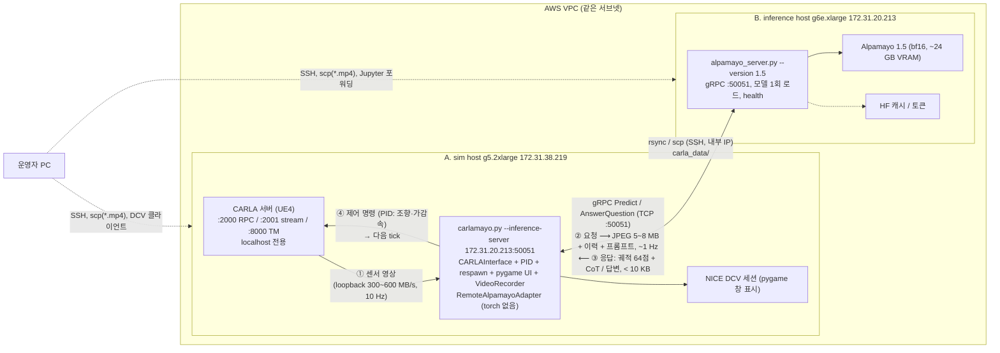
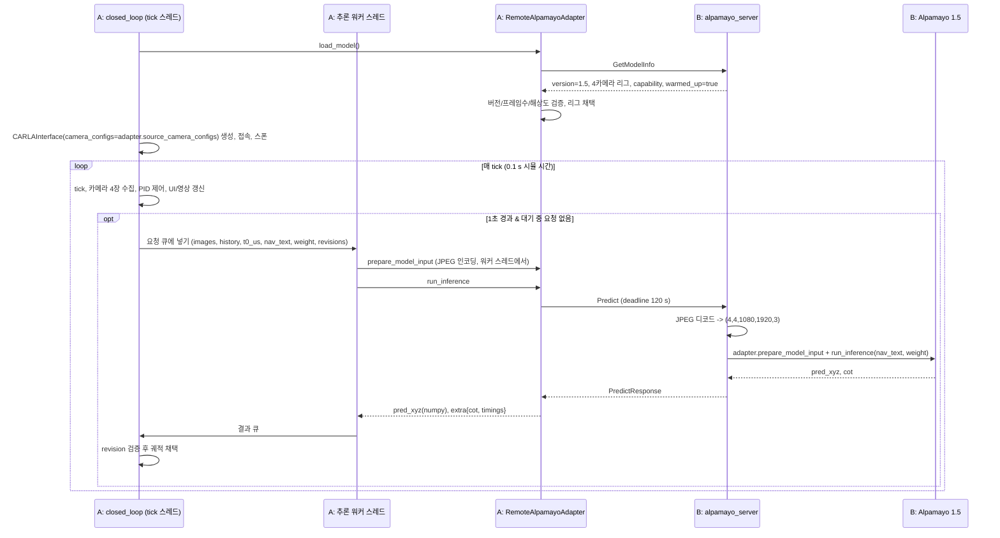
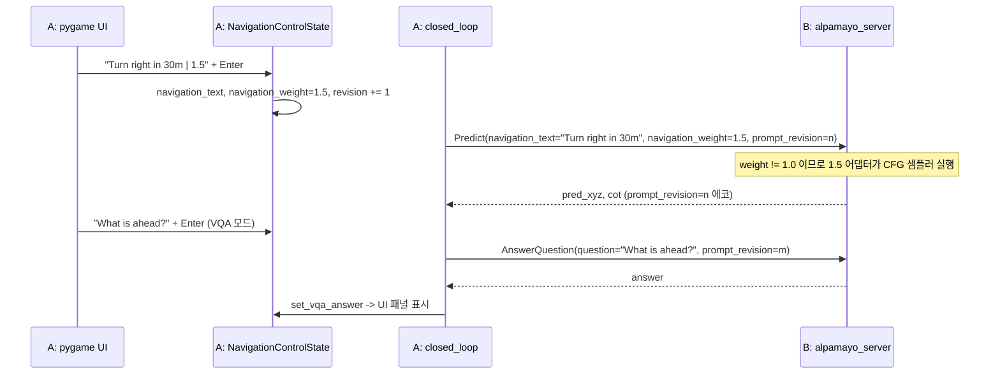
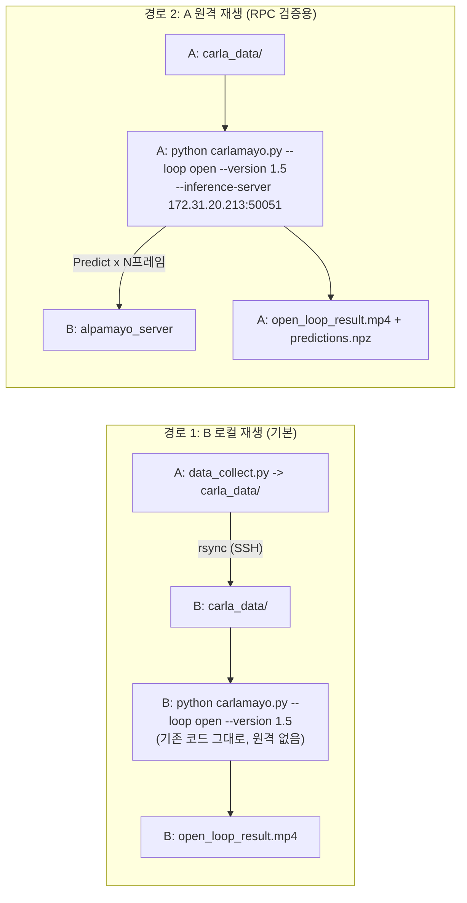
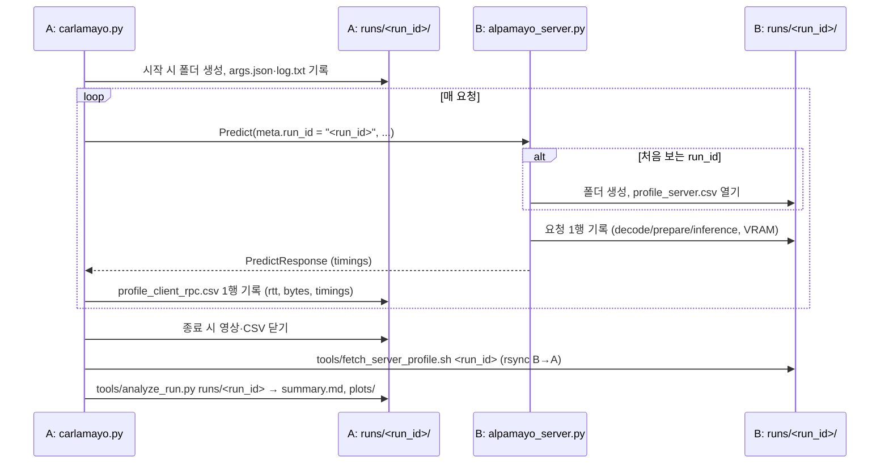

# 분리 구조 설계: CARLA 인스턴스 + Alpamayo 인스턴스

현재 구조의 근거는 [architecture-analysis.md](architecture-analysis.md)에 있다. 이 문서는
**분리 후 구조가 어떻게 되는지, 두 인스턴스가 무엇을 주고받는지, 무엇이 달라지는지**를
정리한다. 설계 결정의 근거와 탈락 후보는 [adr/](adr/README.md)에, 구현 순서는
[distributed-roadmap.md](distributed-roadmap.md)에 있다.

> 로드맵 1~9단계는 구현되어 있다(파일·플래그·RPC 이름은 실제 코드와 같다). 실제 두 인스턴스에서의
> 실측(10단계)은 아직이며, 결과는 [changes-from-upstream.md](changes-from-upstream.md)와 이 문서의
> "실측" 절에 추가한다.

---

## 1. 목표 토폴로지

| 역할 | 인스턴스 | 내부 IP | GPU | 실행하는 것 |
|---|---|---|---|---|
| **A. 시뮬레이터 호스트 (sim host)** | g5.2xlarge | `172.31.38.219` | A10G 24 GB | CARLA 0.9.16 서버, Carlamayo 루프 클라이언트(`carlamayo.py`), PID, pygame UI(NICE DCV), 데이터 수집, 영상 기록 |
| **B. 추론 호스트 (inference host)** | g6e.xlarge | `172.31.20.213` | L40S 48 GB | Alpamayo 추론 서버(`alpamayo_server.py`), 모델 가중치, Hugging Face 토큰, 공식 노트북 |

핵심 원칙 세 가지:

1. **루프(시뮬레이션 제어)는 CARLA 옆에 둔다.** CARLA→클라이언트 센서 트래픽(300~600 MB/s)은
   loopback에 남기고, 1초에 한 번 5~8 MB짜리 추론 요청만 네트워크를 건넌다.
2. **모델은 한 번만 로드해 서버로 상주시킨다.** 클라이언트가 죽거나 재시작해도 모델 로드
   (수 분)를 반복하지 않는다.
3. **기존 어댑터 인터페이스를 그대로 원격화한다.** 루프 코드는 `adapter.run_inference()`를
   부를 뿐, 뒤에 로컬 모델이 있는지 gRPC가 있는지 모른다.

---

## 2. 배포 다이어그램 (분리 후)



### 2.1 네트워크·보안그룹 규칙

| 방향 | 포트 | 허용 소스 | 용도 |
|---|---|---|---|
| A ← 운영자 | 22 (또는 SSM만), 8443 | 운영자 IP | SSH, NICE DCV |
| A ← A | 2000~2002, 8000 | localhost | CARLA RPC/스트림/TM (외부 개방 금지) |
| B ← A | **50051** | A의 보안그룹 ID | gRPC 추론 |
| B ← A | 22 | A의 보안그룹 ID | `rsync`/`scp`로 데이터 복사 |
| B ← 운영자 | 22 (또는 SSM만) | 운영자 IP | SSH, Jupyter 포트포워딩(8888은 개방하지 않고 터널) |
| A, B → 인터넷 | 443 | | Hugging Face(B), apt/pip |

gRPC는 평문(TLS 없음)으로 시작한다. 같은 VPC의 사설 IP 사이이고 보안그룹으로 소스를 A로
제한하므로 충분하다. VPC 밖으로 나갈 일이 생기면 그때 TLS를 켠다.

---

## 3. 인스턴스 간 데이터 교환 명세

### 3.1 gRPC 채널 (A → B, 실시간)

서비스 이름 `carlamayo.v1.AlpamayoInference`. 모든 호출은 A가 시작한다.

| RPC | 언제 | 요청 내용 | 응답 내용 | 크기 | 타임아웃 | 실패 시 A의 동작 |
|---|---|---|---|---|---|---|
| `GetModelInfo` | 클라이언트 시작 시 1회, 이후 오류 후 재접속마다 | 클라이언트 프로토콜 버전 | 모델 버전(1/1.5/2), 표시 이름, **카메라 리그**(이름·위치·FOV, 순서 포함), `viz_camera_slot`, capability(navigation/vqa/oom_free), 서버 옵션(quantization/oom_free/device_map), `NUM_FRAMES`, `NUM_HISTORY`, `IMG_HEIGHT/WIDTH`, `NUM_TRAJ_SAMPLES`, `warmed_up`, VRAM 사용량, 서버 git sha | < 2 KB | 30 s (연결 대기 포함) | 버전·프레임 수·해상도가 `--version`/`config.py`와 다르면 즉시 종료(`SystemExit`). 서버가 `warmed_up=false`면 준비될 때까지 대기 메시지 출력 |
| `Predict` | 궤적 추론. closed/live-open은 약 1 Hz, open-loop는 프레임마다 | 이미지 스택(카메라×프레임 = 4×4 또는 7×4, 각각 JPEG 또는 raw RGB8), `history_xyz`(16,3) f32, `history_rot`(16,3,3) f32, `t0_us`, `navigation_text`, `navigation_weight`, `seed`(선택), 메타(frame, prompt_revision, respawn_revision, request_id, **run_id**) | `pred_xyz`(1,1,S,64,3) f32, CoT 텍스트, 타이밍(디코드/전처리/추론 초, VLM generate 횟수), 메타 에코 | 요청 5~8 MB(JPEG q95, 4캠) / 100 MB(raw 4캠) / 174 MB(raw 7캠), 응답 < 10 KB | `--rpc-timeout-sec` 기본 120 s | `DEADLINE_EXCEEDED`/`UNAVAILABLE` → 기존 "Inference error" 경로로 출력, `pending_inference=False`, 1초 후 재시도. 궤적은 최대 나이 초과 시 폐기하고 정지 |
| `AnswerQuestion` | VQA 모드에서 질문이 바뀔 때마다 1회 | 이미지 스택, `history_xyz/rot`, `t0_us`(Alpamayo 2의 `select_task_input`이 전체 입력을 요구하므로 Predict와 같은 형식), `question` | `answer`, `raw_answer`, 타이밍 | 요청 5~8 MB, 응답 < 4 KB | 120 s | 오류 문자열을 UI 패널의 error 줄에 표시 |
| `grpc.health.v1.Health/Check` | 클라이언트 접속 전, systemd/모니터링 | 없음 | SERVING / NOT_SERVING | 수십 B | 5 s | NOT_SERVING이면 대기 |

**동시성.** 서버는 GPU 하나에 모델 하나이므로 모델 호출을 lock으로 직렬화한다. 두 번째
동시 요청은 `RESOURCE_EXHAUSTED`로 즉시 거절한다. 클라이언트는 원래 한 번에 하나만 보낸다
(1슬롯 큐).

**이미지 인코딩 규칙.** 클라이언트가 가진 배열은 RGB uint8 `(cam, frame, H, W, 3)`이다.
카메라·프레임 순서를 유지한 채 각 장을 `cv2.imencode(".jpg", BGR, 품질)`로 압축하고, 서버는
`cv2.imdecode` 후 RGB로 되돌려 **같은 shape·dtype의 배열을 복원**한 뒤 기존
`adapter.prepare_model_input()`에 넘긴다. `--image-encoding raw`는 무압축 전송으로,
로컬 실행과 비트 단위 동일성을 검증(parity)할 때만 쓴다.

**텐서 인코딩 규칙.** `Tensor{shape, dtype, data}`로 C-order little-endian 바이트를 그대로
담는다. numpy `tobytes()`/`frombuffer()`로 대칭 변환된다.

### 3.2 비실시간 교환 (파일)

| 데이터 | 방향 | 수단 | 용도 |
|---|---|---|---|
| `carla_data/` (7카메라 JPEG + LiDAR + `trajectory.json`, 수 GB) | A → B | `rsync -avz` (SSH, 내부 IP) | open-loop를 B에서 로컬로 돌릴 때 |
| 결과 영상 `carla_alpamayo_*_result.mp4`, `*_pygame_ui.mp4` | A → 운영자 PC | `scp` | closed/live-open 결과 확인 |
| open-loop 결과 영상 | B → 운영자 PC (B 로컬 실행 시) 또는 A → 운영자 PC (원격 실행 시) | `scp` | |
| 서버 로그(`journalctl -u alpamayo-server`), 클라이언트 로그 | 각 호스트에 남김 | 필요 시 `scp` | 지연·오류 분석 |
| parity 결과(`predictions.npz`, 타이밍 CSV) | B → A 또는 운영자 PC | `scp` | 로드맵 10단계 검증 |
| 서버 프로파일 `runs/<run_id>/profile_server*.csv` | B → A | `tools/fetch_server_profile.sh <run_id>` (rsync) | A의 같은 이름 폴더에 합쳐 분석 (§9) |

Hugging Face 토큰과 모델 가중치는 **B에만** 존재한다. A는 모델을 내려받을 필요가 없다.

### 3.3 모듈 배치 매핑

| 모듈 | A (sim) | B (inference) | 비고 |
|---|---|---|---|
| `carlamayo.py` | ✓ | | `--inference-server` 플래그 추가 |
| `module/loops/*` | ✓ | | 원격 어댑터 사용, torch import 제거 |
| `module/carla_interface.py`, `pid_controller.py`, `respawn_control.py`, `navigation_control.py`, `pygame_ui.py`, `visualization.py`, `open_loop_dataset.py`, `config.py` | ✓ | (config만 공유) | 변경 없음 또는 torch import 제거 |
| `data_collect.py`, `module/data_collection.py` | ✓ | | 변경 없음 |
| `module/adapters/base.py`, `_rigs.py`, `__init__.py` | ✓ | ✓ | 양쪽 공통 인터페이스 |
| `module/adapters/alpamayo_{r1,1_5,2}.py`, `oom_offload.py`, `alpamayo_compat.py`, `vlm_generate_optimization.py` | | ✓ | 서버가 그대로 사용 |
| `module/remote/client.py` (`RemoteAlpamayoAdapter`) | ✓ | | 신규 |
| `module/remote/server.py`, `alpamayo_server.py` | | ✓ | 신규 |
| `module/remote/codec.py`, `proto/`, 생성 스텁 | ✓ | ✓ | 신규, torch 비의존 |
| `third_party/*` 서브모듈 | | ✓ | A에서는 초기화하지 않음 |

같은 저장소를 양쪽에 클론하고, A는 `requirements-sim.txt`, B는 `requirements-inference.txt`로
설치한다. 코드는 하나, 설치 프로파일이 둘이다.

---

## 4. 시퀀스 (분리 후)

### 4.1 closed-loop 비동기 모드



동기 모드(`--async` 없음)는 워커 없이 tick 스레드가 `Predict`를 직접 기다린다. CARLA는 그
동안 멈춰 있으므로 **네트워크 왕복 시간이 시뮬 결과를 바꾸지 않는다.** 벽시계 시간만 길어진다.

### 4.2 navigation(CFG)과 VQA가 전달되는 방식



- CFG 가중치는 **그냥 필드 하나로 실려 간다.** 서버 쪽에서는 지금의
  `Alpamayo15Adapter.run_inference(navigation_text, navigation_weight)`가 그대로 호출되므로
  CFG 경로(`sample_trajectories_from_data_with_vlm_rollout_cfg_nav`)가 동일하게 실행된다.
- 프롬프트 상태, 입력창, revision 관리, stale 폐기는 모두 A에 남는다. **사용자 조작 경험은
  지금과 같다.** 달라지는 것은 CFG가 VRAM을 더 쓴다는 점뿐이며, B의 48 GB는 1샘플 CFG에
  충분하다(공식 표는 16샘플 CFG에 60 GB).
- VQA는 지금처럼 정지형이다. 서버는 `run_vqa`를 그대로 호출한다.

### 4.3 open-loop의 두 경로



- 경로 1은 코드 변경 없이 지금 당장 가능하다. open-loop는 원래 CARLA가 필요 없다. 데이터는
  A에서 `rsync`로 B의 `~/carlamayo/carla_data/`에 복사한다.
- 경로 2는 같은 데이터·같은 `seed=42`로 경로 1과 결과를 비교하는 **parity 테스트**에 쓴다.
  `--image-encoding raw`면 같은 GPU에서 비트 단위 동일(또는 1e-6 이내)을 기대하고, JPEG로
  바꾸면 차이가 얼마나 나는지 측정한다.

---

## 5. pygame UI: 어디서 어떻게 보이는가

### 5.1 왜 A에서 실행되는가

UI가 그리는 것은 A에만 있는 것들이다: CARLA 카메라 프레임, PID가 적용한 조향값, 속도, 충돌·
리스폰 상태, 일시정지 플래그, 프롬프트 입력창. B에는 이미지가 1초에 한 번 압축되어 도착할
뿐이고 차량 상태는 아예 없다. 따라서 **pygame 창은 A(g5.2xlarge)에서 뜬다.**

### 5.2 헤드리스 EC2에서 창을 보는 방법

NICE DCV가 A에 이미 설정되어 있으므로 그것을 쓴다.

1. DCV 클라이언트로 A에 접속해 가상 데스크톱을 연다.
2. 그 데스크톱의 터미널에서 `carlamayo.py`를 실행한다. pygame이 DCV의 X 디스플레이에 창을
   만든다.
3. SSH 세션에서 실행해야 한다면 `DISPLAY=:0`(DCV 가상 세션의 디스플레이 번호)을 지정한다.

대안은 두 가지가 있으나 권장하지 않는다. SSH X11 forwarding은 1280×900 화면을 10 Hz로
넘기기엔 느리고, 브라우저 MJPEG 뷰어는 코드를 새로 짜야 한다(필요해지면 로드맵에 추가).

### 5.3 현재 동작과 변경안

현재 동작의 코드 근거는 [architecture-analysis.md §8](architecture-analysis.md)에 있다. 요약하면
`--pygame-ui`를 켜면 모드와 무관하게 일시정지로 시작하고, 일시정지 중에는 시뮬 세계 전체가
멈추며, Ctrl+P로만 풀린다. Enter는 프롬프트만 바꾸고 주행을 멈추지 않는다.

| 항목 | 현재 | 변경안 | 이유 |
|---|---|---|---|
| UI 기본값 | OFF (`--pygame-ui`) | closed-loop에서 **기본 ON**, `--no-pygame-ui`로 해제 | 모든 모드에서 주행 화면을 보고 싶다는 요구 |
| 시작 시 일시정지 | UI가 켜지면 항상 | `--start-paused` 플래그로 분리. 기본은 "normal 모드이거나 초기 프롬프트(`--navigation-text`/`--vqa-question`)가 CLI로 주어졌으면 즉시 주행, 아니면 정지" | 정지는 첫 프롬프트를 받기 위한 것이므로 필요할 때만 |
| navigation(CFG) 중 입력 | 주행 중 Enter로 즉시 적용 (이미 구현) | 그대로 | |
| VQA | 정지형 (궤적 없음) | **그대로** | 모델 텍스트 API가 궤적을 주지 않음. 주행 중 VQA 모드는 만들지 않기로 결정 |
| live-open | UI 없음 | closed-loop와 같은 UI 표시(입력창 없이 상태 패널만) | 오토파일럿 주행 모습 확인 |
| 창 기록 | `*_pygame_ui.mp4` | 그대로 | DCV 없이도 나중에 확인 가능 |

원격 어댑터와 UI는 서로 독립이다. UI 변경은 A의 루프 코드에만 닿고 RPC 계약에는 영향이 없다.

---

## 6. 전/후 비교

| 항목 | 현재 (단일 호스트) | 분리 후 |
|---|---|---|
| 프로세스 | CARLA 서버 + 클라이언트(모델 포함) 2개, 한 호스트 | A: CARLA 서버 + 클라이언트 / B: 추론 서버. 3개, 두 호스트 |
| Python 환경 | 3개 venv(CARLA용, 모델용, 합집합) | A: `requirements-sim.txt`(py3.10 또는 3.12, torch 없음) / B: `requirements-inference.txt`(py3.12). 합집합 환경 소멸 |
| GPU | 한 GPU에 CARLA 6 GB + 모델 24 GB, 또는 2 GPU | A: CARLA만(24 GB 중 6 GB) / B: 모델만(48 GB 중 24 GB, CFG 여유 있음) |
| OOM 대책 | `--quantization`, `--oom-free`, `-graphicsadapter=1` | 불필요(서버 옵션으로만 남김) |
| 네트워크 트래픽 | 없음(loopback) | A→B 5~8 MB/s 수준(JPEG, 1 Hz), B→A 수 KB/s |
| 추론 1회 지연 | 모델 추론 시간 T (1.5: 수 초) | T + JPEG 인코딩(0.1~0.3 s, async에서는 워커 스레드) + 디코딩(수십 ms) + RTT(< 1 ms) |
| 동기 모드 결정성 | 추론 중 세계 정지 | 동일. 네트워크 지연도 세계 정지 중에 흡수 |
| 비동기 모드 궤적 나이 | T | T + 0.2~0.4 s |
| 모델 로드 | 클라이언트 실행마다 수 분 | 서버 시작 시 1회. 클라이언트는 수 초 내 시작 |
| 장애 도메인 | 하나가 죽으면 전부 재시작 | 클라이언트/CARLA 재시작해도 서버 유지. 서버 재시작 시 클라이언트는 오류 출력 후 재접속 |
| 안전장치 | 추론 실패 시 마지막 궤적을 무기한 사용 | 궤적 최대 나이 초과 시 정지(신규) |
| 비용 | GPU 1대 상시 | GPU 2대. 필요 없을 때 각각 정지 가능(예: open-loop만 할 때 A 정지) |
| 사용자 조작 | CLI + pygame | 동일 + `--inference-server` 플래그. 서버 기동 절차 추가 |

---

## 7. 인터페이스 계약 (`module/remote/alpamayo_inference.proto`)

```proto
syntax = "proto3";
package carlamayo.v1;

service AlpamayoInference {
  rpc GetModelInfo(GetModelInfoRequest) returns (ModelInfo);
  rpc Predict(PredictRequest) returns (PredictResponse);
  rpc AnswerQuestion(VqaRequest) returns (VqaResponse);
}

message GetModelInfoRequest { string client_protocol_version = 1; }

message CameraConfig {
  string name = 1; double x = 2; double y = 3; double z = 4;
  double pitch = 5; double yaw = 6; double fov = 7;
}

message ModelInfo {
  string protocol_version = 1;
  string version = 2;            // "1" | "1.5" | "2"
  string model_id = 3;
  string display_name = 4;
  repeated CameraConfig cameras = 5;   // 순서 = 이미지 카메라 축 순서
  repeated int32 camera_indices = 6;
  int32 viz_camera_slot = 7;
  bool supports_navigation = 8; bool supports_vqa = 9; bool supports_oom_free = 10;
  bool quantization = 11; bool oom_free = 12; string device_map = 13;
  int32 num_frames = 14; int32 num_history = 15;
  int32 img_height = 16; int32 img_width = 17; int32 num_traj_samples = 18;
  bool warmed_up = 19; double vram_allocated_gb = 20; string server_git_sha = 21;
}

message Tensor { repeated int32 shape = 1; string dtype = 2; bytes data = 3; }  // C-order, LE
message ImageFrame { bytes data = 1; string encoding = 2; int32 height = 3; int32 width = 4; } // "jpeg" | "raw_rgb8"
message ImageStack { int32 num_cameras = 1; int32 num_frames = 2; repeated ImageFrame frames = 3; } // 카메라 우선, 그 다음 시간

message ClientMeta {
  string request_id = 1; int64 frame = 2;
  int32 prompt_revision = 3; int32 respawn_revision = 4;
  string run_id = 5;   // A가 만든 실행 폴더 이름. B는 같은 이름으로 폴더를 만든다 (§9)
}

message PredictRequest {
  ClientMeta meta = 1; ImageStack images = 2;
  Tensor history_xyz = 3; Tensor history_rot = 4; int64 t0_us = 5;
  string navigation_text = 6; double navigation_weight = 7;
  optional int64 seed = 8;
}
message Timings {
  double decode_sec = 1; double prepare_sec = 2; double inference_sec = 3; double total_sec = 4;
  int32 vlm_generate_calls = 5; double vlm_generate_last_sec = 6;
}
message PredictResponse { ClientMeta meta = 1; Tensor pred_xyz = 2; string cot_text = 3; Timings timings = 4; }

message VqaRequest {
  ClientMeta meta = 1; ImageStack images = 2;
  Tensor history_xyz = 3; Tensor history_rot = 4; int64 t0_us = 5;
  string question = 6;
}
message VqaResponse { ClientMeta meta = 1; string answer = 2; string raw_answer = 3; Timings timings = 4; }
```

**불일치 가드.** 클라이언트는 `GetModelInfo` 응답의 `version`이 `--version`과, `num_frames`·
`num_history`·`img_height`·`img_width`·`num_traj_samples`가 자기 `config.py`와 같은지 확인하고
다르면 종료한다. 서버가 다른 버전으로 재시작되면 카메라 리그가 달라져 조용히 잘못된 결과가
나올 수 있기 때문이다. 재접속 후에도 같은 검사를 반복한다.

**gRPC 옵션.** 양쪽 `max_send/receive_message_length = 512 MB`(기본 4 MB는 JPEG도 넘김),
keepalive 20 s. 서버는 요청 처리용 스레드 풀 + 모델 lock.

---

## 8. 리스크와 대응

| # | 리스크 | 대응 |
|---|---|---|
| R1 | JPEG 재인코딩이 모델 입력을 바꿔 결과가 달라짐 | 데이터 수집(`data_collect.py`)도 JPEG로 저장하므로 open-loop는 이미 JPEG 입력이었음. 모델이 196,608픽셀로 축소하므로 q95 아티팩트는 대부분 사라짐. parity 테스트로 raw 대비 차이를 수치로 남김 |
| R2 | raw 전송 시 대역폭 | 174 MB/요청은 10 Gbps에서도 0.15~1.4 s. raw는 진단 전용으로 문서화 |
| R3 | A에서 JPEG 인코딩 CPU 비용 | 1080p 16장 ≈ 0.1~0.3 s. `--async`에서는 워커 스레드에서 수행되어 tick에 영향 없음. 동기 모드에서는 tick이 그만큼 길어짐 |
| R4 | `t0_us` 시계 문제 | 프레임 카운터 기반이라 호스트 시계와 무관. 지연 측정은 각 호스트의 monotonic 시간 차이만 사용 |
| R5 | 서버/클라이언트 설정 불일치 | §7 가드 + `server_git_sha` 로그 |
| R6 | 네트워크 실패 후 오래된 궤적으로 계속 주행 | `cfg.TRAJECTORY_MAX_AGE_SEC`(예: 3 s) 초과 시 궤적 폐기·정지 |
| R7 | 서버 워밍업 전에 클라이언트가 붙음 | 서버는 로드 후 더미 추론 1회로 커널 컴파일을 끝낸 뒤 `warmed_up=true`, health SERVING. 클라이언트는 그때까지 대기 |
| R8 | 보안 | 서버는 사설 IP에만 바인드, 보안그룹으로 A만 허용, CARLA 포트는 localhost, HF 토큰은 B에만 |
| R9 | B의 4 vCPU로 JPEG 디코딩 여유 | 16장 디코딩 ≈ 50~100 ms, 1 Hz에서 문제 없음. 7카메라(2) 사용 시 재확인 |
| R10 | pygame 창이 DCV 세션 밖(SSH)에서 실행되어 실패 | `DISPLAY` 설정 안내를 cheat sheet에 명시 |
| R11 | 샘플링 비결정성 | open-loop는 `seed=42`를 요청에 실어 재현. closed-loop는 원래 시드 없음(스모크 테스트만) |
| R12 | `uv.lock` 재생성이 flash-attn 때문에 CI에서 불가 | B에서 재생성해 커밋 |

---

## 9. 실행 결과 폴더와 프로파일링

### 9.1 실행 결과 폴더 (run 디렉터리)

업스트림은 영상 파일명이 고정(`module/config.py:23-25`)이라 다시 실행하면 이전 결과를 덮어쓴다.
실행마다 다음 규칙의 폴더를 만들고 산출물을 전부 그 안에 둔다.

```
runs/<YYYYMMDD-HHMMSS>_<loop>_v<version>_<mode>[_<tag>]/      ← 이 폴더명이 run_id
├── args.json                     # CLI 인자 전체, git sha, 호스트명, 시작 시각
├── log.txt                       # 터미널 출력 복제
├── carla_alpamayo_closed_loop_result.mp4
├── carla_alpamayo_closed_loop_result_pygame_ui.mp4
├── profile_client.csv            # A: tick 단위
├── profile_client_rpc.csv        # A: RPC 단위
├── profile_client_sys.csv        # A: 1초 단위 시스템 자원
├── profile_server.csv            # B에서 가져옴: 요청 단위
├── profile_server_sys.csv        # B에서 가져옴
├── summary.md                    # analyze_run.py 결과: 통계 표
└── plots/*.png                   # analyze_run.py 결과: 시계열 그래프
```

예: `runs/20261001-143022_closed_v1.5_navigation_cfg15/` (`--run-tag cfg15`).

### 9.2 두 호스트의 폴더 이름을 같게 맞추는 방법: run_id 전달

시계를 맞춰 이름을 추측하지 않는다. **A가 폴더명을 만들고 그 문자열을 모든 RPC의
`ClientMeta.run_id`에 실어 보내면, B는 처음 보는 run_id가 올 때 같은 이름의 폴더를 만든다.**
실행이 끝나면 A에서 `tools/fetch_server_profile.sh <run_id>`로 B의 CSV를 A의 같은 폴더로
가져와 한곳에서 분석한다.



B에서 open-loop를 로컬로 돌릴 때(경로 1)는 원격 요청이 없으므로 B가 스스로 run_id를 만든다.

### 9.3 기록 항목

`--profile`(기본 on)로 켜고 `--no-profile`로 끈다. 기록은 별도 스레드가 CSV로 쓰므로 tick
경로를 막지 않는다.

| 파일 | 어디 | 한 행 | 열 |
|---|---|---|---|
| `profile_client.csv` | A | tick | frame, sim_time, wall_time, tick_sec, camera_capture_sec, control_sec, ui_sec, speed_kmh, steer, trajectory_age_sec, pending_inference |
| `profile_client_rpc.csv` | A | RPC | request_id, frame_submitted, encode_sec, request_bytes, response_bytes, rtt_sec, server_total_sec, inference_sec, status |
| `profile_client_sys.csv` | A | 1 s | cpu_percent, rss_mb, gpu_util, gpu_mem_used_mb(CARLA 포함), net_sent_bps, net_recv_bps |
| `profile_server.csv` | B | 요청 | request_id, run_id, recv_wall_time, decode_sec, prepare_sec, inference_sec, vlm_generate_sec, total_sec, request_bytes, gpu_mem_allocated_mb, gpu_mem_peak_mb, gpu_util |
| `profile_server_sys.csv` | B | 1 s | A와 같음 |

라이브러리: `psutil`(CPU/RAM/네트워크), `pynvml`(GPU), 기존 `module/vlm_generate_optimization.py`의
`VlmGenerateTiming`(VLM 생성 시간).

### 9.4 분석 산출물

`python tools/analyze_run.py runs/<run_id>`:

- `summary.md`: 항목별 count / mean / std / min / p50 / p95 / max 표. RPC 왕복 시간을 서버 측
  총 시간과 나란히 두어 네트워크+인코딩 오버헤드를 바로 읽을 수 있게 한다.
- `plots/`: `inference_time.png`, `rtt.png`(클라이언트 왕복 vs 서버 처리), `gpu_mem.png`(A·B),
  `cpu.png`, `net.png`(A 송신 = 요청 대역폭), `trajectory_age.png`.
- `python tools/analyze_run.py compare runs/<id1> runs/<id2> ...`: 여러 run의 요약을 한 표로.
